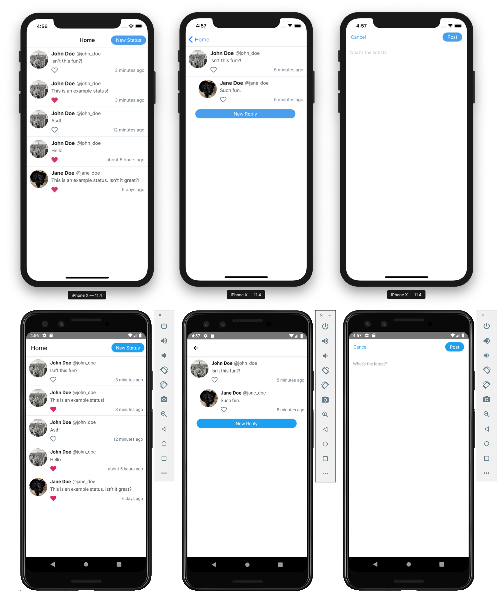

## React Native Social Media App

### Installation

> **Note:** Be sure you have the React Native CLI [installed on your system](https://facebook.github.io/react-native/docs/getting-started).

- `git clone https://github.com/ReactNativeSchool/react-native-social-media-app.git`
- `cd mobile`
- `yarn install`/`npm install`
- `(cd ios && pod install)`
- `cd ../server`
- `yarn install`/`npm install`

### Running Mobile

- `cd mobile`
- `yarn run ios`/`npm run ios` or `yarn run android`/`npm run android`

### Running Server

- `cd server`
- `yarn dev`

---

